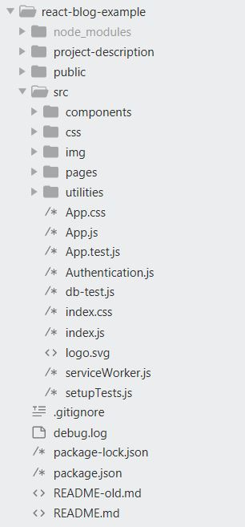

This project was bootstrapped with [Create React App](https://github.com/facebook/create-react-app).

## Hosted Project

https://nameless-bayou-60696.herokuapp.com/

## Project Intro

The idea of project is simple. It's a Blog!
There are posts(articles) on the blog. You can `create`, `read`, `update`, `delete` posts, (CRUD in short).

Why we chose to go with Blog and Posts?

Well, because idea could be related to any other application. If you will think that posts are products, you have not a blog, but an online store or any other application. (You can relate your application to this one!!) All other actions are the same, `create`, `read`, `update`, `delete`. So this CRUD principle is base of most application on the web.

## Thinking about our Blog

So let's start of of something basic. Our Blog can have:
- 3 simple, static html pages, Home, About, Contact.
- *Header and Footer* are present on every page.
- *Post Archive page*, which will have list view of posts.
- *Single Post view*, that will be showing detailed info of the post.
- *Admin page*, where user can create, update, delete posts.
- *Login page*, where user would be able to login as admin.

And that's it.

## Thinking in depth

Let's give more thought about previously mentioned parts of the blog.
- All the pages should be done in react components.
- Navigation between pages, Header, Footer should be done using React Router library.
- As we don't use our database, we will be retrieving posts from fake API and rendering their list in Post Archive page.
- On the Single Post view we will be retrieving info only about one particular post, also from API.
- Our CRUD actions will be implemented by creating state, state management functions, filling state with posts fetched from API and propagating them down to components via props.
- Admin page will have it's own nested navigation, done with React Router.
- Login page will be using authentication mechanism.

## Chosing our tools

Each feature should be done with additional specific technology, library or function. Based on what we previously mentioned, lets define what we need to use:

- React Router, for page navigation, redirects.
- Javascript Fetch API, for retrieving data from API.
- React Hooks and props for state management.
- Authentication Mechanism for login into system.

## Folder structure



## Project Phases

Having all that information, now we can divide our project into development phases. Each phase will be combination of Project Part we are creating and Technology(library) we are using for it.

### Phase #1: Page Components (technologies: React Components, React Router)

- Turning pages into components.
- Using React Router to navigate.
- Creating Header and Footer.

### Phase #2: List Post View, Single Post View (technologies: React Router Parameters)

List Item View and Single Item View - it's a concept where you have One page that
displays list of items(posts or products) with general details and another page displays single item but with more details. You can find it in any web application.

Todo
- Creating pages List Post View and Single Post View


- Set up Router parameters to handle id in routes.
in 

```
<Route path="/posts/:id">
    <SinglePostPage />
</Route>
```

- Add id to link in List Item View.
```
const postItems = posts.map((post, index) => {
		return (
			<li key={index} class="post-list-item border">
				<div class="post-feature-image">
						
				</div>
				<div class="post-text">
```
	`				<h3><Link to={"/posts/" + post.id}>{post.title}</Link></h3>`
```
					<p class="border">
						{post.body}
					</p>
				</div>
			</li>
		);
	});
```
- Grab id from url parameters in Single Item View.
```
import React, { useState, useEffect } from 'react';
import { useParams } from 'react-router-dom';

const SinglePostPage = () => {
	let { id } = useParams();
```

This phase as whole, you can check more detailed in these files.
- 
- 
- 

### Phase #3: Creating State (technologies: Fetch API React Hooks, props)

- Fetching data into our application
- Creating  State.
- Propagating state data through props into lower components.
- Turning data into HTML elements, rendering data.

### Phase #4: Admin Page and it's subpages (technologies: React Router, Nested Routes, subnavigation)

- Creating Admin page.
- Creating Posts and Create Post subpages.
- Rendering posts data in admin table.

### Phase #5: Implementing CRUD operations (technologies: Javascript Array Methods, React Hooks)

- Implementing action delete.
- Implementing action create.
- Implementing action edit.

### Phase #7: Creating Login Page (technologies: React Router, Authentication Mechanism)

- Creating Login Page.
- Using React Router for Protected Routes.
- Implementing Authentication.
- Handling Login form.

